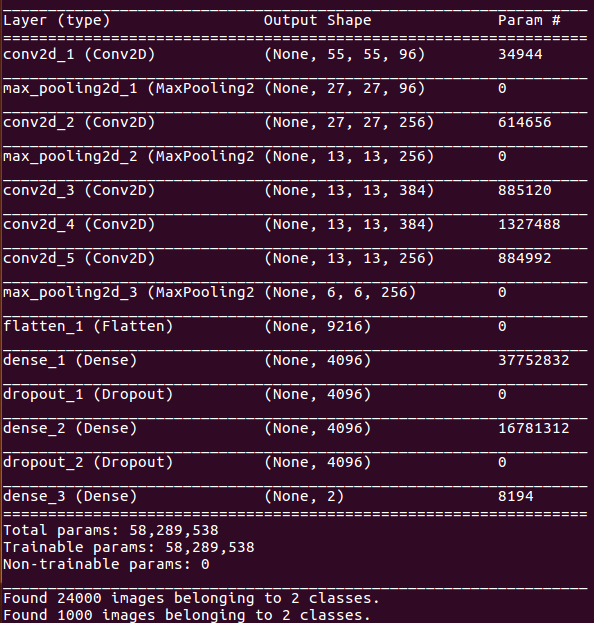

# AlexNet

## Architecture

## Param Num
### conv2d_1:34944=(3×11×11+1)×96
### conv2d_2:614656=(96×5×5+1)×256
### conv2d_3:885120=(256×3×3+1)×384
### conv2d_4:1327488=(384×3×3+1)×384
### conv2d_5:884992=(384×3×3+1)×256
### dense_1:37752832=(9216+1)×4096
### dense_2:16781312=(4096+1)×4096
### dense_3:8194=(4096+1)×2

## Dataset
[Dogs vs. Cats](https://www.kaggle.com/c/dogs-vs-cats/data)

